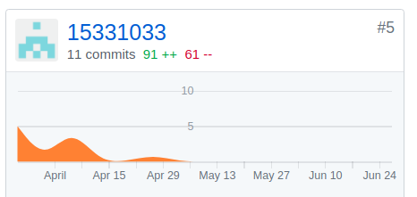
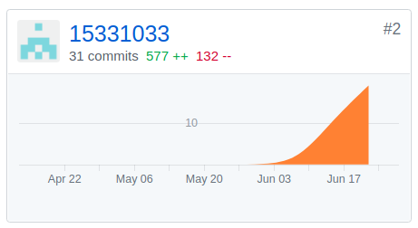

#### X3 Final Report
##### 15331033 陈文彬
##### PSP 2.1 统计表
|PSP2.1|Personal Software Process Stages|Time(%)|
|:--:|:--:|:--:|
| <b> Planning <b> | <b> 计划 <b> | <b> 4 <b> |
|Estimate|估计这个任务需要多少时间|4|
| <b> Development <b> |<b> 开发 <b> |<b> 83 <b> |
|Analysis|市场调研,需求分析|20|
|Design Spec|生成设计文档|5|
|Design Review|设计复审|3|
|Coding Standard|代码规范|2|
|Design|具体设计|8|
|Coding|具体编码|30|
|Code Review|代码复审|5|
|Test|测试|10|
| <b> Reporting <b> | <b> 报告 <b> | <b> 15 <b> |
|Test Report|测试报告|5|
|Size MeaSurement|计算工作量|5|
|Postmortem&Process Improvement Plan|时候总结,并提出过程改进计划|5|
##### 个人分支的 GIT 统计报告（不需要解释原因）- 仅需要提交截图
dashboard   
  
backend   
  
##### 自认为最得意/或有价值/或有苦劳的工作清单，含简短说明（一句话）
- 用django自带用户系统登录并保持登录状态,模拟微信接口返回用户信息,方便后续衔接微信的开发
- 跟前端对接解决csrf-token校验问题
