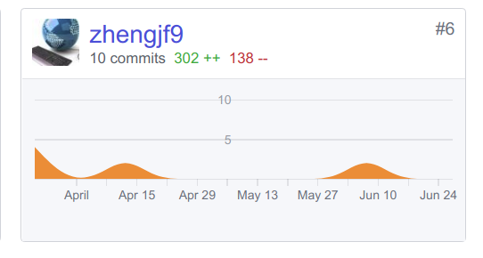
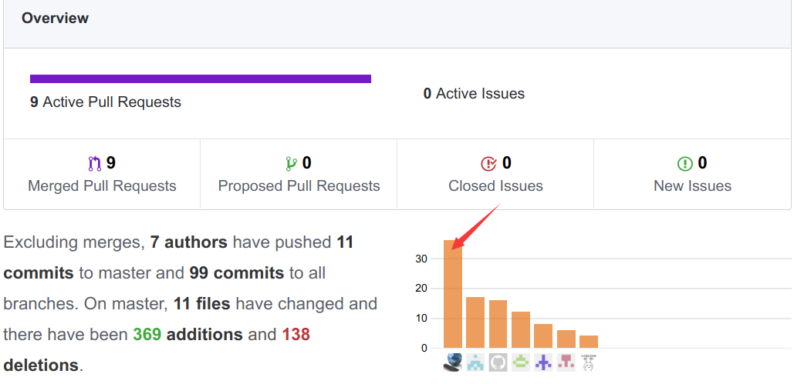
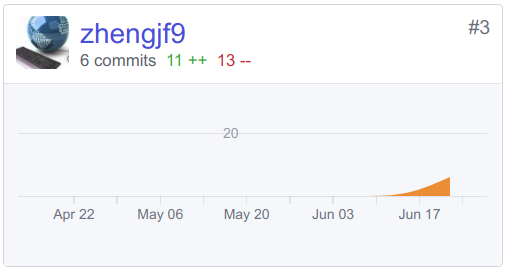

## Final Report

1、PSP 2.1 统计表

| PSP2.1                              | Personal Software Process Stages | Time(%) |
| ----------------------------------- | -------------------------------- | ------- |
| **Planning**                        | **计划**                           | 10      |
| Estimate                            | 估计这个任务需要多少时间                     | 10      |
| **Development**                     | **开发**                           | 75      |
| Analysis                            | 市场调研,需求分析                        | 8       |
| Design Spec                         | 生成设计文档                           | 8       |
| Design Review                       | 设计复审                             | 5       |
| Coding Standard                     | 代码规范                             | 3       |
| Design                              | 具体设计                             | 11      |
| Coding                              | 具体编码                             | 30      |
| Code Review                         | 代码复审                             | 5       |
| Test                                | 测试                               | 5       |
| **Reporting**                       | **报告**                           | 15      |
| Test Report                         | 测试报告                             | 5       |
| Size MeaSurement                    | 计算工作量                            | 5       |
| Postmortem&Process Improvement Plan | 总结,并提出过程改进计划                     | 5       |

2、个人分支的 GIT 统计报告:

dashboard:

后面的commit纪录不知为啥没算进去……截另外一个地方

backend:

3、自认为最得意/或有价值/或有苦劳的工作清单，含简短说明（一句话）:

撰写文档清单：

| 文档名称                                     | 描述                 |
| ---------------------------------------- | ------------------ |
| [About](https://easymealorder.github.io/dashboard/docs/about) | 迭代计划               |
| [Usecase Diagram](https://easymealorder.github.io/dashboard/docs/Requirement_specification/requirements_and_userCase) | 设计一个用例             |
| [System Sequence Diagram](https://easymealorder.github.io/dashboard/docs/Requirement_specification/System_sequence_diagram) | 系统顺序图，定义各个系统的交互逻辑  |
| [Supplementary Requirements](https://easymealorder.github.io/dashboard/docs/supplementary_requirements) | 对系统的功能性、可用性等做进一步说明 |
| [UI设计(迭代版)](https://easymealorder.github.io/dashboard/docs/UI/%E6%96%B0UI%E8%AE%BE%E8%AE%A1) | 优化UI               |
| [Software Architecture Document](https://easymealorder.github.io/dashboard/docs/software_architecture_document) | 架构图、逻辑视图、物理视图      |
| [Usecase Design](https://github.com/EasyMealOrder/dashboard/blob/gh-pages/docs/ecb-user-case.md) | ECB的顺序图和类图         |
| [框架目录设计、逻辑架构与ECB的关系](https://github.com/EasyMealOrder/dashboard/blob/gh-pages/docs/SDP/%E6%A1%86%E6%9E%B6%E7%9B%AE%E5%BD%95%E8%AE%BE%E8%AE%A1%E3%80%81%E9%80%BB%E8%BE%91%E6%9E%B6%E6%9E%84%E4%B8%8EECB%E7%9A%84%E5%85%B3%E7%B3%BB.md) | ECB与架构映射           |
| [短视频](https://github.com/EasyMealOrder/dashboard/blob/gh-pages/docs/Show/%E6%88%90%E5%93%81%E5%B1%95%E7%A4%BA.md) | 用于展示成品             |

​制定迭代计划，维持团队进度。

4、个人的技术类、项目管理类博客清单:

​       Ubuntu下Django开发环境搭建：

> http://zjfblog.club/2018/04/15/%E7%B3%BB%E7%BB%9F%E5%88%86%E6%9E%90%E4%B8%8E%E8%AE%BE%E8%AE%A1-3/

