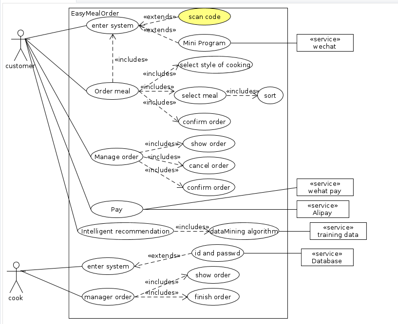

#### requirements
|  ID  |       requirements        |
| :--: | :-----------------------: |
|  1   |   customer enter syetem   |
|  2   |        order meal         |
|  3   |   customer manage order   |
|  4   |            pay            |
|  5   | Intellgent recommendation |
|  6   |     cook enter system     |
|  7   |    cook manager order     |
#### Use Case Diagram

Use Case:点餐

Actors：客人，订餐系统，支付接口

Porpose：支持用户选餐并提交订单、支付

Type：primary

Overview：顾客进入点餐系统进行点餐。

1、选择添加想要点的菜，同样的菜可以选择多次。

2、已选的菜会出现在底部的订单中（包括菜名，数量，价格和总价）

3、可以在底部订单中增加或减少每一道菜的数量。

4、点击确定按钮生成订单，弹出支付窗口。

Use Case: 管理订单  
Actors: 客人，支付网关, 订餐系统  
Porpose: 捕捉客人管理订单的过程  
Type；primary  
Overview: 一个顾客下订单后，进行支付，之后订餐系统后端接受到订单，厨师开始准备菜式。  

1.客人选好菜后，在页面上点击订单结算。  
2.客人在订单详情界面看到自己点的菜式及数量，价格，备注等信息。  
3.客人点击确认，选择支付网关。  
4.客人通过支付网关付款。  
5.订餐系统收到订单，订单详情显示在供厨师使用的后端上。  

Variation：  
2.1如果客人不想要一道菜，可以在界面上取消。其他信息也可以更改。  
4.1如果客人中途终止，则退回到订单详细页面，显示未支付。  
4.2如果支付网关异常，则退回到订单详细页面，显示未支付，并提示支付网关异常。  

Use Case: 处理订单  
Actors: 厨师, 订餐系统  
Porpose: 供厨师处理和管理订单  
Type: primary  
Overview: 该界面显示用户已提交的订单,厨师完成一个订单后点击完成,后台提示用户订单已完成并传入下一个用户的菜单  

1.厨师完成一个用户订单后，在页面上点击完成按钮。 
2.订餐系统收到完成信息,给已完成订单的用户发送消息并传入下一个订单  

### detailed style
#### use case 1 :点餐
+ 范围：EasyMealOrder客户端
+ 级别：用户目标
+ 主要参与者：顾客
+ 涉众与关注点：
    + 顾客：希望能便捷点餐
    + 厨师：希望准确知道顾客的所点菜单
+ 前置条件：无
+ 成功条件：厨师端顺收到顾客菜品，系统更新销售信息。
+ 主成功场景：
    1. 顾客扫码进入点餐界面。
    2. 选择所需的菜式和数量。
    3. 确认菜式和数量，可以增减。
    4. 确认无误，提交。
    5. 系统将订单推送到厨师端。
    6. 系统记录销售信息，存到数据库。

+ 替代流程
     +  顾客无法扫码点餐（没手机、不会用等）
        1. 呼叫服务员帮点菜。 
     +  系统故障导致无法点餐
        1. 呼叫服务员手动写单
     +  提交之后取消菜品
        1. 不支持此功能
     +  提交后，还想追加订单
        1. 再次扫码下单
        
#### use case 1 :处理订单
+ 范围：EasyMealOrder厨师端
+ 级别：子功能
+ 主要参与者：厨师
+ 涉众与关注点：
    + 厨师：有序地处理顾客地订单，并且记录进度。
+ 前置条件：无
+ 成功条件：厨师根据订单完成菜品制作。
+ 主成功场景：
    1. 厨师查看订单队列的头订单。
    2. 根据菜式制作。
    3. 制作完后点“完成”，服务员送至顾客桌上。

+ 替代流程
     +  系统故障，无法点击“完成”
        1. 用纸笔记录。 
     +  有纸质订单
        1. 照做，纸笔打勾记录完成状况。
     + 服务员忙，不能及时送餐
        1.等待一段时间，服务员空闲再送餐，

