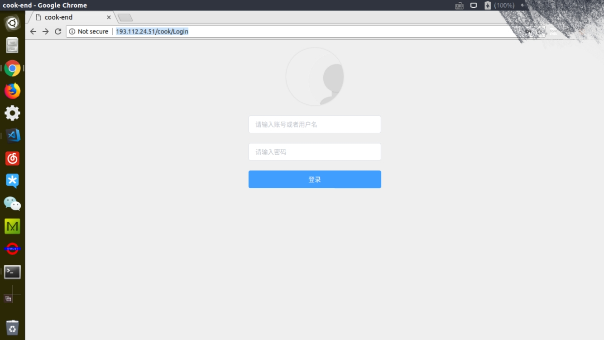

##  用户手册
###  手机客户端
#### 扫码
用QQ或者TIM或者浏览器扫描二维码登录即可
#### 点餐
#####  第１步：选择一种您喜爱的菜品

点击侧边栏不同的菜式可查看相应的菜品，点击某个菜品的 “+” 按钮可将该菜品加入餐盘，点击菜品可以进入菜品详细信息页

#####  第２步：提交订单

在首页选择完需要的菜品后，点击置顶菜单栏中的“餐盘”可查看当前未提交订单并修改菜品和数量
确认订单信息后，点击下方“去付款”按钮会弹出备注输入弹窗，输入订单备注后，点击“支付订单”跳转到支付界面 / 点击“取消订单”取消订单提交

####  查看历史订单

点击置顶菜单栏中的“我”可查看用户个人信息，点击“历史订单”查看当前用户的订单记录

在历史订单界面可查看到历史订单详情、状态等信息，且可以对订单进行评价

### 厨师客户端
#### 登录
厨师访问以下网址登录厨师管理平台\
http://193.112.24.51/cook/Login \
登录界面如下所示

输入账号密码登录即可（账号密码由管理平台提供）

#### 个人信息
个人信息页显示个人信息，点击左边侧边栏个人信息

#### 接收和管理订单
点击左边侧边栏全部订单选项即可进入订单管理页面，收到客户订单时右上角会有消息通知，菜品完成时可以点击订单项目的完成按钮

### 管理者平台
用于给管理者添加菜品和发布厨师账号的平台
