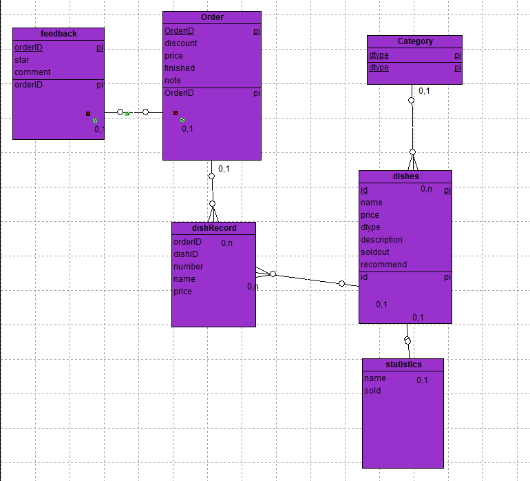

# 软件设计文档

该文档介绍EasyMealOrder项目的设计和实现  


## DashBoard
该仓库存放软件开放相关资料和文档  


## 后端backEnd
后端采用Django2.0+python3开发，使用了Django自带的用户模块和后台管理系统管理内容，通过Django Restful Framework来提供json数据。  
下面介绍目录结构  
```
emo
  --emo
     --urls.py #django的url处理模块
     --settings.py #django的配置模块
  --dishes  #提供菜色和分类相关信息
    --views.py  #提供视图，通过django restful framework提供json信息
    --serializers.py  # 规定了如何让model序列化
    --models.py # 定义了数据模型，通过与模型的交互，完全避免了直接的数据库操作
  --order #提供订单相关的操作，包括订单信息获取，提交订单，取消订单等，内部结构同dishes
  --frontpage #提供扫描获得的桌号的验证服务
  --login #厨师端登陆的方法
  --wslogin #用户登陆，同时模拟了微信验证的体系
  --statistic #一些杂项信息，比如用户反馈等
```
数据库信息的设计：



需要指出的是得益于Django的ORM技术，可以并不需要去数据库中创建Table，只需要在django的语言层面上创建对象，就能实现同数据库的交互。    
通过Django的配置文件的设置，可以自动化地将使用的数据库转换成另一种数据库。    

### 技术细节
#### Django
Django作为一个后端框架，拥有庞大的生态圈，同时因为自带数据管理系统，可以方便快速地进行开发。     
本项目将模块分割成了多个app，每个app内包含views.py和models.py文件   

Django的工作流程如下：
```
Django接受到HTTP请求，解析相关数据，生成request
       
      ↓  
      
Django通过url和请求类型将request和相关参数转发给views中的方法

     ↓
     
views中的方法请求model类，获取数据或者存放数据
      
     ↓
     
     
views方法返回数据或者网页视图

```

在urls.py中包含着url相关的指示信息，用来指示django将请求给哪个方法处理   
一个例子：  
 ```python
  ...
    path('dish/',dishes_api.getAllDishInfo,name="getAllDishInfo"),
    path('dish/<int:dishid>/',dishes_api.getOneDishInfo,name="getOneDishInfo"), #<>包住的是可变量，要交给view方法作为参数
  ...
 ```

下面以Order为例：     
models.py中部分内容   
 ```python
 #order/models.py
 #该类继承了django的model原型，通过定义自己的成员完成了数据库Table的创建。
 #这个文件都是用来定义这样的数据库对象。
 class Order(models.Model):
    id = models.BigAutoField(primary_key=True)
    username = models.CharField('用户名', max_length=150)
    price=models.FloatField('价格')    
    finished=models.BooleanField('是否完成')
    cancel=models.BooleanField('是否取消')
    note = models.TextField('标注')
    table = models.IntegerField('桌号')
    
    
    def __str__(self):
        return '订单号'+str(self.id)

 ```
 
 views.py   
 这个文件中定义的是view方法，用于相应http请求，提供内容。  
 
 #### Django Restful Framework  
 Django本身并没有针对于Restful API进行设计，虽然你可以自己手动创建json手动返回。  
 但是有这样的工具来简化你的操作，没有理由不使用的。   
 
 django restful framework带来了称为serializer的部件，它能将django的model类中的数据   
 转换成json样式，不需要你自己提取数据！  
 
 下面是order目录中的serializers.py部分内容  
 ```python
 #order/serializers.py
 #定义了一个serializer，可以看到它关联的是Order模型，会提取所有field的信息
 class DetailOrderSerializer(serializers.ModelSerializer):
    class Meta:
        model = Order
        field = '__all__'
        exclude = ()
 ```


使用了django restful framework后views也会有所不同：  
再次以order举例  
```python
@api_view(['GET'])  #DRF的装饰器，表示GET方法可以使用这个view方法
@authentication_classes((SessionAuthentication, ))  #基于django的user系统的session验证功能
@permission_classes((IsAdminUser,))   #只允许管理人员访问这个方法
def getUnfinishedOrder(request):
    res = Order.objects.filter(finished=False)
    serial = DetailOrderSerializer(res,many=True)  #把得到的model信息放进serializer中
    return Response(serial.data)         #无需任何信息提取，直接返回，就是一个标准的json数据
```


在Django和Django Restful Framewrok的世界里，搞定用户验证也是简单至极： 

```python
@api_view(['POST'])   #只接受POST方法
@authentication_classes((SessionAuthentication, )) #验证服务
def createOrder(request):
    #这里已经完成了验证，request.user已经记录了用户信息
    if not request.user.is_authenticated:   #用户没有被验证通过就返回一个异常的订单号
        return Response({'orderID',-6})
        
    ....
```

后端的数据流向如下

```
  JSON <---> views <---> serializers <---> models <---> DB

```


#### 静态服务器部署
django自带一个调试用的runserver方法，但是性能很差不能用来用于生产环境。  
需要借助成熟的web服务器来启动我们的django项目。  
我们使用的是uwsgi+nginx来提供内容  

## 前端
此项目是前端用户手机端点餐的实现，使用了Vue框架进行编写，项目使用了vue-cli和webpack来创建基本目录。
#### 目录结构
- WebOrder(手机端)

```
static
  --images
      --favicon.png
src
  --main.js
  --App.vue
  --api
      --unitedInterface.js
  --assets
      --logo.png
  --components
      --Login
          --Login.vue
      --Detail
          --Detail.vue
      --Main
          --index.vue
          --tabs.vue
          --Home
              --Aside.vue
              --DishList.vue
              --Home.vue
              --ImgCarousel.vue
          --Myself
              --MiddleBlock.vue
              --Myself.vue
          --Plate
              --Plate.vue
              --PlateWrapper.vue
      --Order
          --Order.vue
      --PayResult
          --PayResult.vue
  --router
      --index.js
  --store
      --index.js
      --modules
        --allDishes.js
        --cart.js
        --userInfo.js
```
#### 技术
使用了webpacke和vue-cli自带的各种技术
- 热启动

webpack自动生成的配置文件，位于build/webpack.dev.conf.js中
- 类库

使用了Elment-UI的一些UI组件来美化UI
```javascript
Vue.use(ElementUI)
```
- babel

使用了webpack自动生成的babel作为转码器，以便使用 ES2015、ES2016 甚至 ES2017 中的一些新特性如`解构赋值，箭头函数`等,配置文件位于.babelrc

- ngnix反向代理

前端在访问api的时候用了ngnix代理来转发api请求
```ngnix
location /api/ {
            proxy_pass http://193.112.24.51:9000/;
        }
```
- eslint

使用了webpack自带的eslint,配置文件位于.eslintrc.js

## 厨师短
这是厨师用的。

```
static
  --images
      --test.png
src
  --main.js
  --App.vue
  --api
      --unitedInterface.js
  --assets
      --logo.png
  --components
      --Login
          --index.vue
      --Main
          --index.vue
          --aside.vue
          --CookEnd
              --cookEnd.vue
          --Order
              --order.vue
  --router
      --index.js
  --store
      --index.js
      --modules
        --cook.js
```

#### 技术
和客户端一致。
