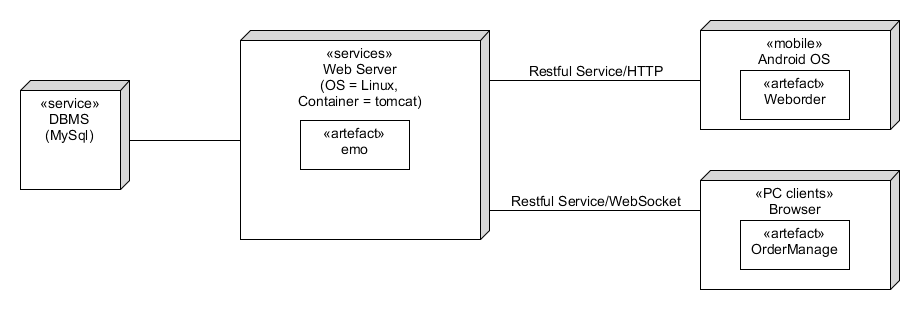

## 软件架构文档

### 简介

本文档将从架构方面对系统进行综合概述，其中会使用多种不同的架构视图来描述系统的各个方面。它用于记录并表诉已对系统的架构方面作出的重要决策。

### 架构图

### 解决方案说明（技术备忘录）

**解决方案概要**：

使用微服务的方式实现解耦合

**因素：**

- 整个点餐系统包括用户端和店家端，相对比较复杂
- 用户端和店家端相对比较独立

**解决方案：**

对项目功能进行划分，使用docker打包到不同容器

**未决问题：**

无

### 逻辑视图

### 物理视图

